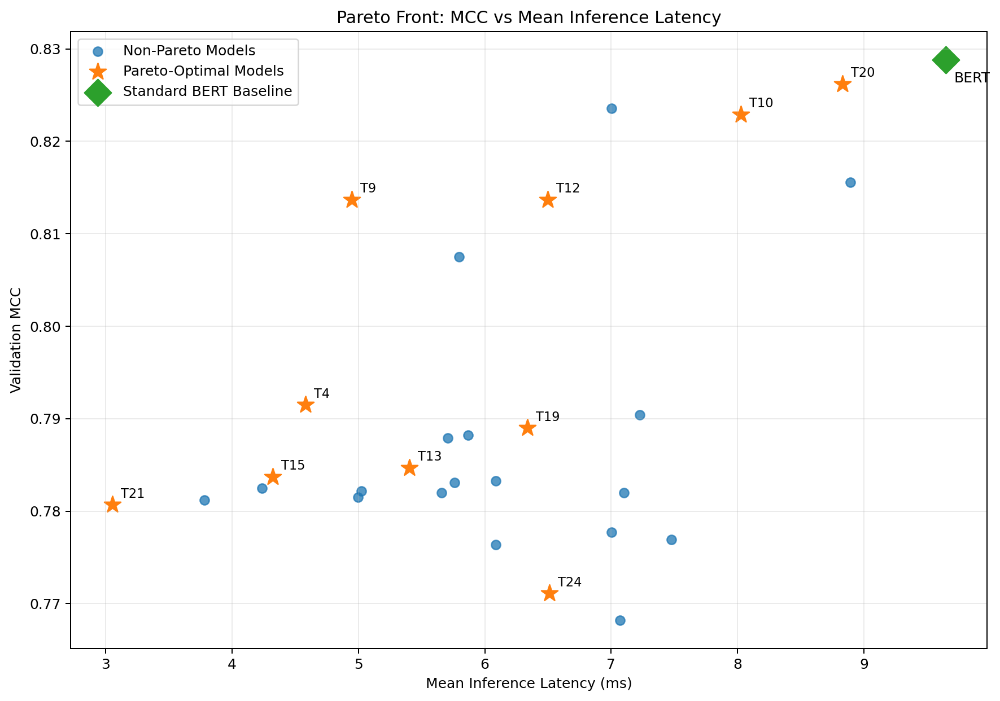
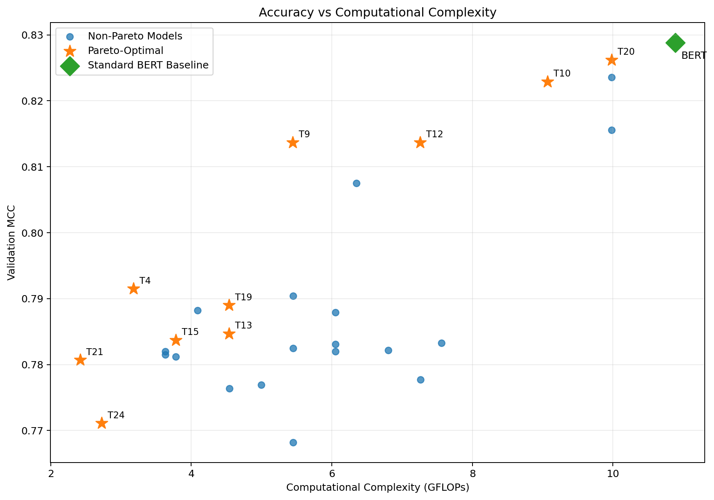
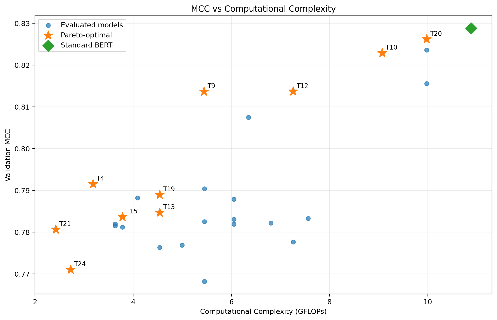
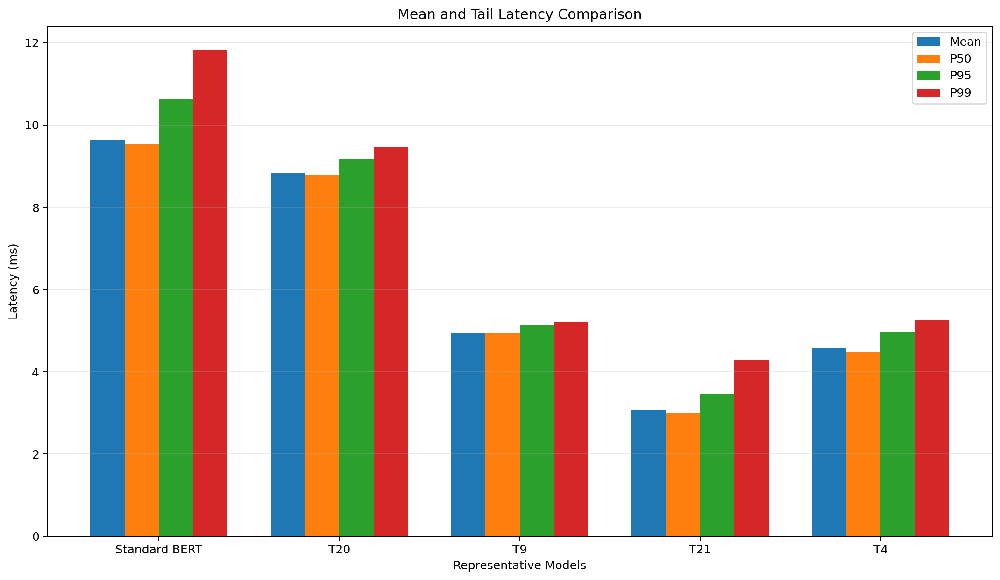
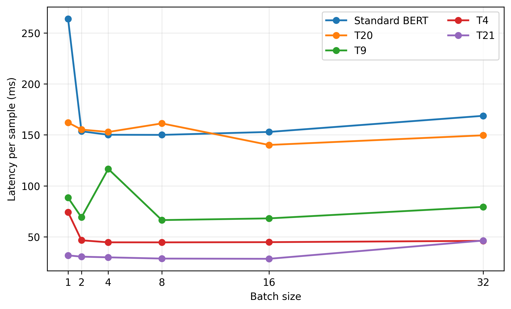
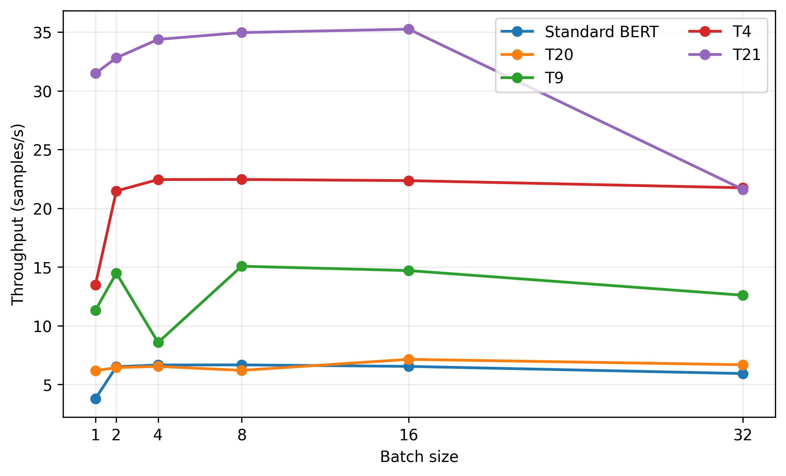
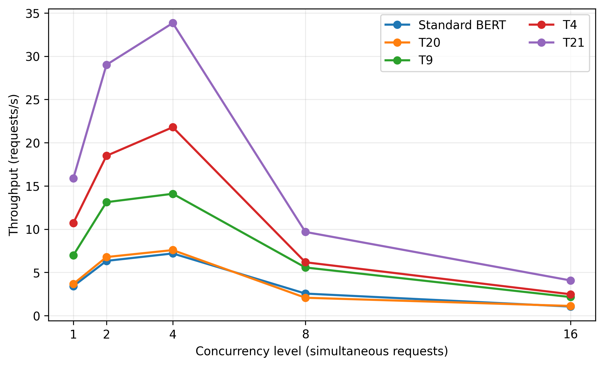

# DATMO: Deployment-Aware Two-Phase Multi-Objective Transformer Optimization

A deployment-oriented framework for systematically optimizing BERT-style Transformer architectures across **predictive performance and inference efficiency**.

> **Status:** Research project / manuscript under review at IEEE UPCON 2026.
>
> **Code availability:** The public repository currently contains the methodology, experiment outputs, result tables, and figures. The training/search source code is intentionally not included. See [`docs/reproducibility.md`](docs/reproducibility.md).

## Overview

Transformer models can provide strong predictive performance while incurring substantial computational, memory, and inference costs. DATMO addresses this by separating optimization into two sequential phases:

1. **Phase I — Training-configuration optimization:** optimize learning rate, weight decay, batch size, and encoder-layer freeze ratio while keeping the standard BERT-base architecture fixed.
2. **Phase II — Architecture-aware multi-objective optimization:** search over Transformer depth, attention heads, and FFN capacity while optimizing four objectives simultaneously:
   - maximize validation **Matthews Correlation Coefficient (MCC)**
   - minimize inference latency
   - minimize peak inference GPU memory
   - minimize computational complexity (FLOPs)

The result is a **Pareto front of non-dominated architectures**, rather than a single model, allowing deployment practitioners to select an operating point according to their latency, compute, memory, and predictive-performance constraints.

## Key results

Experiments use the **PubMed 200K RCT** dataset for five-class medical abstract sentence classification. Due to computational constraints, the study uses 50,000 training samples, 5,000 validation samples, and 5,000 test samples, with maximum sequence length 128.

| Model | Layers | Heads | FFN | MCC | GFLOPs | Mean latency (ms) | Size (MB) |
|---|---:|---:|---:|---:|---:|---:|---:|
| Standard BERT | 12 | 12 | 4 | 0.8288 | 10.8845 | 9.6450 | 417.66 |
| T20 | 11 | 12 | 4 | 0.8262 | 9.9776 | 8.8276 | 390.62 |
| T9 | 6 | 6 | 4 | 0.8137 | 5.4428 | 4.9496 | 255.43 |
| T4 | 7 | 12 | 1 | 0.7915 | 3.1789 | 4.5804 | 187.90 |
| T21 | 4 | 4 | 2 | 0.7807 | 2.4209 | 3.0551 | 165.33 |

The representative models span a wide range of predictive-efficiency trade-offs. T20 is close to the Standard BERT MCC while reducing GFLOPs, mean latency, and model size; T21 provides the lowest computational cost and mean latency among the representative configurations.

### ONNX Runtime CPU validation

| Model | Mean (ms) | P50 (ms) | P95 (ms) | P99 (ms) | Throughput (samples/s) |
|---|---:|---:|---:|---:|---:|
| Standard BERT | 165.49 | 160.28 | 183.61 | 249.11 | 6.04 |
| T20 | 144.87 | 144.66 | 148.26 | 156.65 | 6.90 |
| T9 | 78.90 | 76.65 | 86.02 | 123.36 | 12.67 |
| T4 | 52.48 | 52.32 | 54.66 | 56.66 | 19.05 |
| T21 | 34.41 | 34.09 | 36.01 | 44.49 | 29.07 |

T21 reduces mean CPU latency from 165.49 ms to 34.41 ms and increases throughput from 6.04 to 29.07 samples/s in the reported ONNX Runtime benchmark.

## Framework

```text
                     PubMed 200K RCT
                            |
                            v
             +---------------------------+
             | Phase I: Training Config  |
             | LR / Weight Decay         |
             | Batch Size / Freeze Ratio |
             +-------------+-------------+
                           |
                           v
             +---------------------------+
             | Phase II: Architecture    |
             | Layers / Heads / FFN       |
             | Hidden size fixed = 768    |
             +-------------+-------------+
                           |
                           v
        +-----------------------------------------+
        | Multi-objective optimization             |
        | MCC ↑ | Latency ↓ | Memory ↓ | FLOPs ↓ |
        +-------------------+---------------------+
                            |
                            v
                    Pareto-optimal set
                            |
                            v
                 ONNX Runtime validation
             batch-size + concurrency scaling
```

## Phase I configuration

The best Phase I configuration reported in the study is:

| Parameter | Value |
|---|---:|
| Learning rate | 2.0041 × 10⁻⁵ |
| Weight decay | 1.4619 × 10⁻⁵ |
| Batch size | 8 |
| Freeze ratio | 0.1832 |

Phase I uses Optuna's TPE sampler with seed 42 and 15 trials. Each trial is trained for two epochs using AdamW.

## Phase II search space

| Parameter | Search space |
|---|---|
| Transformer layers | 4–12 |
| Attention heads | {4, 6, 8, 12} |
| FFN multiplier | {1, 2, 3, 4} |
| Hidden dimension | 768 (fixed) |

The complete Cartesian search space contains 144 possible architectures. Optuna's NSGA-II sampler with seed 42 evaluates 30 configurations.

## Deployment validation

The selected models are exported to ONNX using opset 17 and evaluated with ONNX Runtime on CPU. The study evaluates:

- single-request inference latency
- P50/P95/P99 tail latency
- batch-size scalability at batch sizes {1, 2, 4, 8, 16, 32}
- throughput under increasing batch size
- concurrency stress at {1, 2, 4, 8, 16} CPU threads
- prediction consistency after ONNX conversion

For batch-size experiments, 10 warm-up and 50 measured CPU inferences are used. For concurrency experiments, 10 warm-up and 50 measured single-sample inferences are used.

## Repository structure

```text
DATMO/
├── README.md
├── .gitignore
├── CITATION.cff
├── data/
│   ├── complete_phase2_results.csv
│   └── phase2_pareto_front.csv
├── results/
│   ├── phase1_best_config.csv
│   ├── representative_models.csv
│   └── onnx_runtime_cpu.csv
├── figures/
│   ├── accuracy_vs_complexity.png
│   ├── pareto_mcc_vs_latency.png
│   ├── mean_tail_latency.png
│   ├── batch_size_latency.png
│   ├── batch_size_throughput.png
│   └── concurrency_throughput.png
├── docs/
│   ├── methodology.md
│   ├── results.md
│   └── reproducibility.md
├── paper/
│   └── README.md
├── notebooks/
│   └── README.md
└── src/
    └── README.md
```

## Figures

### Pareto trade-off



### MCC vs computational complexity



> Note: the uploaded source figure uses **“Accuracy”** in its title while the y-axis is **Validation MCC**. The underlying experiment metric is MCC; the repository therefore describes this plot as MCC vs computational complexity.

A corrected-title version generated from the supplied Phase II results is also included as [`figures/mcc_vs_complexity.png`](figures/mcc_vs_complexity.png).



### Mean and tail latency



### Batch-size latency



### Batch-size throughput



### Concurrency throughput



## Dataset

The experiments use the **PubMed 200K RCT dataset**, a benchmark for medical abstract sentence classification with five rhetorical classes. The original dataset is not redistributed in this repository. The experiment uses a fixed subset of 50,000 training, 5,000 validation, and 5,000 test samples, with sequence length capped at 128 tokens.

## Authors

- **Sanat Bhatia** — EC Department, NSUT, New Delhi
- **Amit K. Gangwar** — EC Department, NSUT, New Delhi
- **Kriti Singh** — EC Department, NSUT, New Delhi
- **Richa Bhatia** — EC Department, NSUT, New Delhi

## Citation

If this work is published, replace the provisional citation information in [`CITATION.cff`](CITATION.cff) with the final DOI and publication metadata.

## Important note on the manuscript

The associated manuscript is currently treated as a research submission under review. A public GitHub repository can affect anonymity or venue-specific review rules. The repository therefore does **not** include the manuscript PDF by default. Add the manuscript only when the venue permits public posting.

## License

No open-source license is asserted for the research materials in this repository at this time. If you want to permit reuse of the figures/results, add an appropriate license after confirming that all included materials are yours to license.
